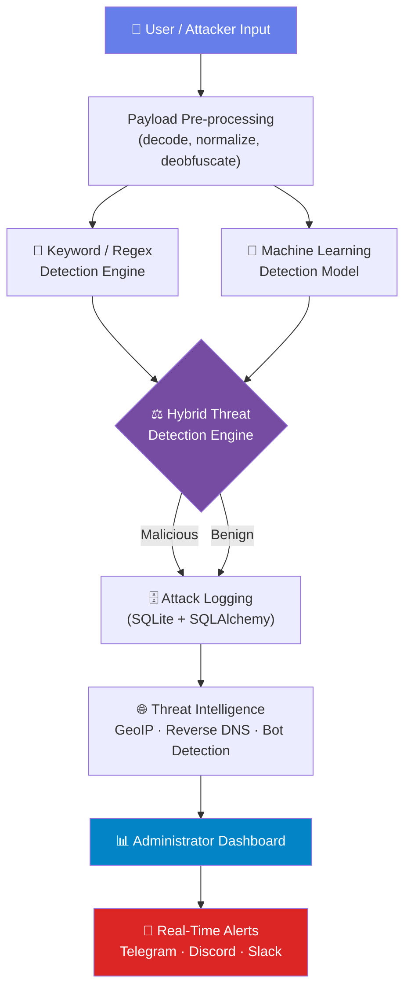
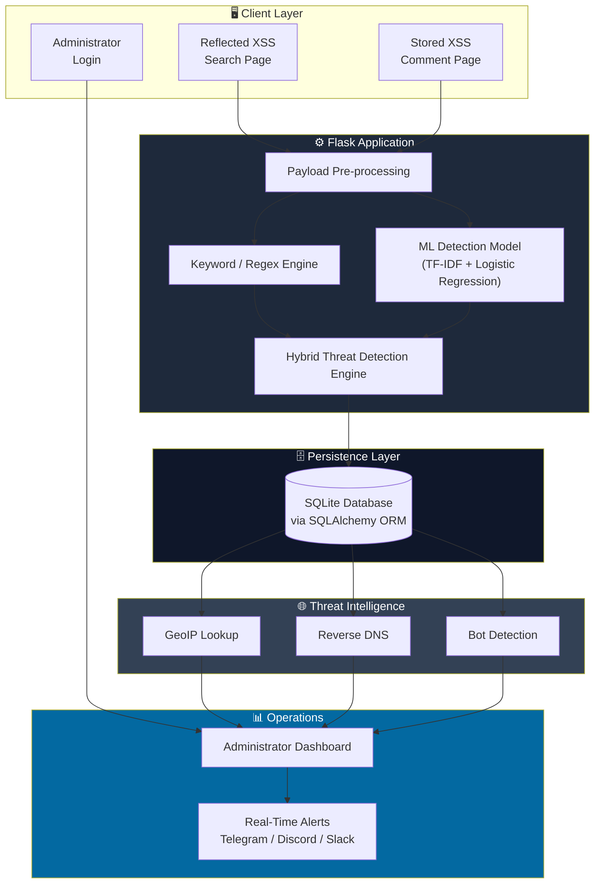
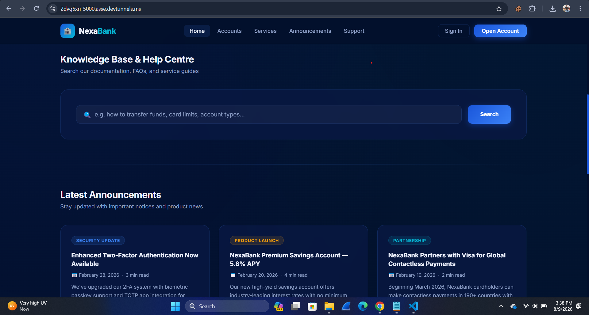
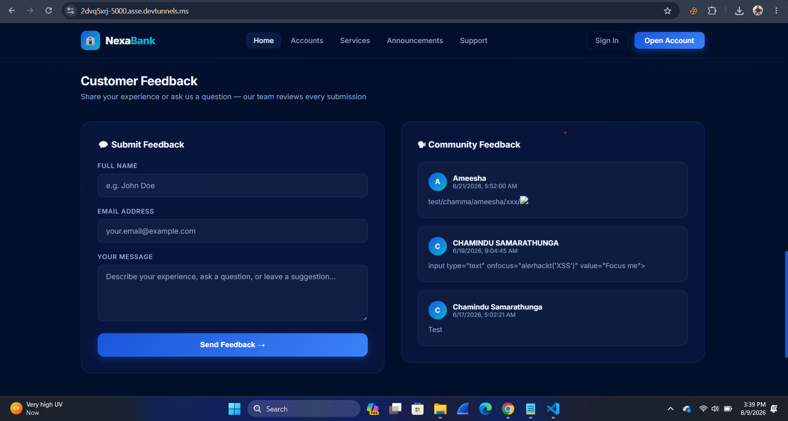
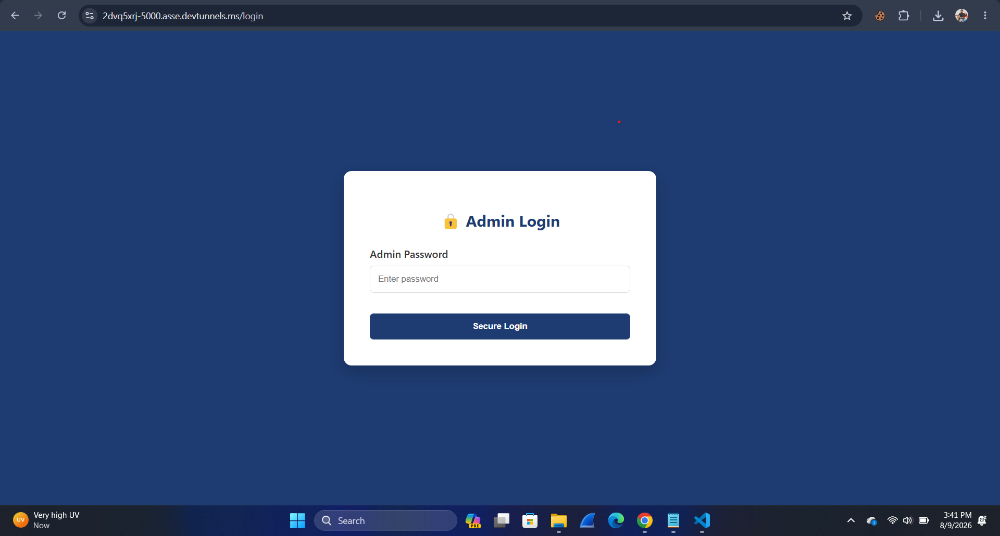
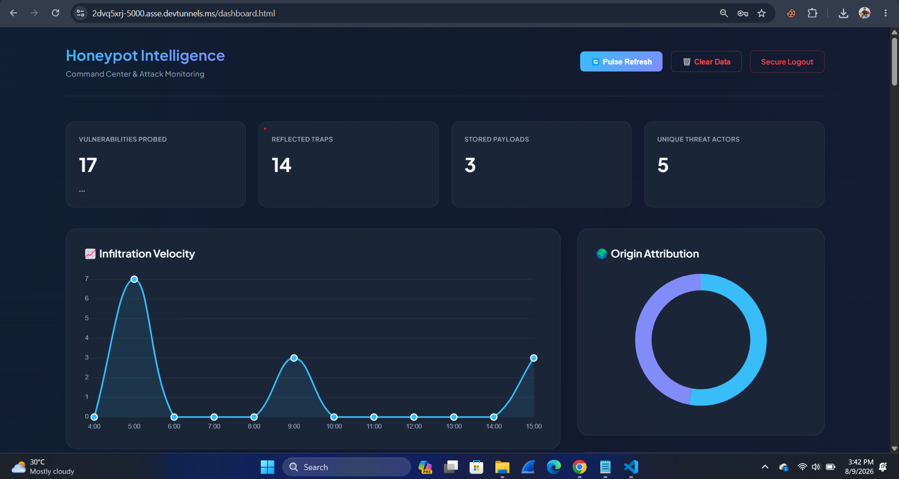
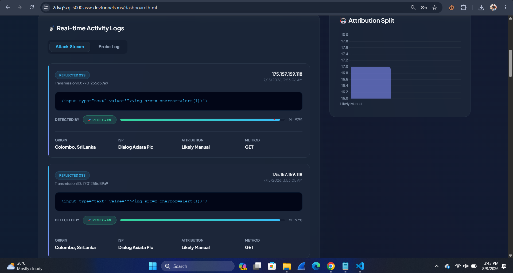

<div align="center">

# 🛡️ ML-Based XSS Honeypot

### A Hybrid Machine Learning & Rule-Based Honeypot for Detecting, Monitoring and Analyzing Reflected & Stored Cross-Site Scripting Attacks

[](https://www.python.org/)
[](https://flask.palletsprojects.com/)
[](https://scikit-learn.org/)
[](https://www.sqlite.org/)
[](#-license)

[](../../stargazers)
[](../../network/members)
[](../../issues)
[](../../commits)

**Cybersecurity Research Project · Web Application Security · Machine Learning · Threat Detection**

[Overview](#-project-overview) ·
[Features](#-main-features) ·
[Architecture](#️-system-architecture) ·
[Installation](#-installation) ·
[Running the App](#️-running-the-application) ·
[Training the ML Model](#-training-the-machine-learning-model) ·
[Results](#-results)

</div>

---

## 📌 Project Overview

The **ML-Based XSS Honeypot** is a web-based cybersecurity research system designed to detect, capture, monitor, and analyze **Reflected** and **Stored Cross-Site Scripting (XSS)** attacks within a controlled, isolated environment.

It combines **Machine Learning classification** with traditional **Keyword/Regex detection** to form a hybrid threat detection engine — rather than relying on a single method, submitted payloads are analyzed through multiple detection layers and logged for further security research.

This project was developed as a **Computer Researching Project** for the **Pearson BTEC HND in Computing** programme at **CINEC Campus**.

---

## 🎯 Objectives

- Design a controlled honeypot environment for Reflected & Stored XSS detection
- Implement a hybrid detection engine combining ML + Keyword/Regex
- Capture, monitor and analyze malicious payloads and attacker behavior
- Provide an administrator dashboard for live threat monitoring
- Enrich attack data with threat intelligence (GeoIP, reverse DNS, bot detection)
- Deliver real-time alerts via Telegram / Discord / Slack
- Support cybersecurity education, research and secure development practices

---

## 🚨 Problem Statement

Traditional web security controls often rely purely on predefined signatures, which struggle against:

- Modified or obfuscated XSS payloads
- Previously unseen attack patterns
- Suspicious inputs that don't exactly match known signatures
- Limited visibility into attacker behavior over time

This project addresses that gap by combining **honeypot technology + rule-based detection + Machine Learning + attack logging + threat intelligence** inside a controlled research environment.

---

## 🧠 Hybrid XSS Detection Engine



### 1️⃣ Keyword / Regex Detection
Fast rule-based matching against known XSS keywords, script tags, event-handler attributes, and regex signatures for recognizable payload structures.

### 2️⃣ Machine Learning Detection
Text-based classification using:

- **TF-IDF** feature extraction
- **Logistic Regression** classifier
- Trained on a labeled dataset of malicious/benign payloads

### 3️⃣ Hybrid Decision
Results from both engines are merged in the **Hybrid Threat Detection Engine**, giving broader coverage than either approach alone — including a confidence score per verdict.

---

## 🔬 Machine Learning Model

| Dataset Category         |   Samples |
|---------------------------|----------:|
| Malicious XSS Payloads    |     1,272 |
| Benign Inputs              |     1,272 |
| **Total**                  | **2,544** |

### Model Performance

| Metric      |    Result |
|-------------|----------:|
| Accuracy    | **98.82%** |
| Precision   |    **99%** |
| Recall      |    **99%** |
| F1-Score    |    **99%** |
| ROC-AUC     |  **1.00** |

> ℹ️ These figures reflect the project's documented evaluation results and should not be interpreted as guaranteed performance against all real-world XSS attacks — highly obfuscated or novel payloads may still evade detection.

---

## 🏗️ System Architecture



The implementation uses a **Flask** application, **scikit-learn** for ML classification, **SQLite + SQLAlchemy** for persistence, external **threat intelligence** services, and **webhook-based** notification channels.

---

## 🔎 Main Features

<table>
<tr>
<td width="50%" valign="top">

### 🧪 XSS Honeypot Interfaces
- Reflected XSS testing interface
- Stored XSS testing interface
- Controlled research environment
- Payload capture & analysis

### 🤖 Machine Learning Detection
- TF-IDF feature extraction
- Logistic Regression classification
- Malicious / benign classification
- Confidence-scored predictions

### 🔍 Rule-Based Detection
- Keyword detection
- Regex pattern matching
- Suspicious pattern identification

</td>
<td width="50%" valign="top">

### 🗄️ Attack Logging
- Payload, method, timestamp
- Detection method & result
- Confidence score
- Source IP, ISP, geolocation

### 🌐 Threat Intelligence
- GeoIP lookup
- Reverse DNS lookup
- Bot / automation detection

### 📊 Admin Dashboard & Alerts
- Real-time monitoring & analytics
- Attack trends & origin distribution
- Telegram / Discord / Slack alerts

</td>
</tr>
</table>

---

## 🖥️ Application Components

```text
Web Application
│
├── Reflected XSS Search Page
├── Stored XSS Comment Page
├── Administrator Login
│
├── Payload Pre-processing Module
├── Keyword / Regex Detection Engine
├── Machine Learning Detection Model
├── Hybrid Threat Detection Engine
│
├── Attack Logging Module
├── Threat Intelligence Module
├── Real-Time Alert Module
│
├── SQLite Database
└── Administrator Dashboard
```

---

## 🛠️ Tech Stack

<div align="center">


</div>

| Technology | Purpose |
|---|---|
| **Python** | Core application development |
| **Flask** | Web application framework |
| **HTML / CSS / JS** | Frontend structure, styling & interaction |
| **SQLite + SQLAlchemy** | Attack log storage & ORM |
| **Scikit-learn** | ML model training & inference |
| **Pandas / NumPy** | Dataset preprocessing |
| **TF-IDF + Logistic Regression** | Text feature extraction & classification |
| **Regex** | XSS pattern detection |
| **GeoIP / Reverse DNS** | Threat intelligence enrichment |
| **Telegram / Discord / Slack** | Real-time alert delivery |

---

## ⚙️ Requirements

- Windows 10/11, macOS, or Linux
- Python 3.x
- pip
- A modern browser (Chrome / Edge)
- VS Code *(optional but recommended)*

---

## 🚀 Installation

### 1. Clone the repository

```bash
git clone https://github.com/YOUR-USERNAME/YOUR-REPOSITORY.git
cd YOUR-REPOSITORY
```

### 2. Create a virtual environment

```bash
python -m venv venv
```

**Windows**
```bash
venv\Scripts\activate
```

**macOS / Linux**
```bash
source venv/bin/activate
```

### 3. Install dependencies

```bash
pip install -r requirements.txt
```

### 4. Configure environment variables

Create a `.env` file in the project root (never commit real secrets):

```env
SECRET_KEY=change_this_to_a_random_secret
DATABASE_URL=sqlite:///honeypot.db
ADMIN_PASSWORD=change_this_password
DISCORD_WEBHOOK_URL=
SLACK_WEBHOOK_URL=
```

> 🔐 Add `.env` and `*.db` to your `.gitignore` before pushing — don't publish real credentials or captured attack data.

---

## ▶️ Running the Application

Start the Flask server:

```bash
python app.py
```

The app runs on:

```text
http://127.0.0.1:5000
```

### Testing the honeypot

| Step | Action |
|---|---|
| 1 | Open the home page at `http://127.0.0.1:5000` |
| 2 | Submit test payloads on the **Reflected XSS Search Page** |
| 3 | Submit test payloads on the **Stored XSS Comment Page** |
| 4 | Payloads are processed by the hybrid detection engine automatically |
| 5 | Log in at `/admin/login` (or `/login`) and open `/dashboard` to review results, detection method, confidence score, source info and threat intelligence |

---

## 🤖 Training the Machine Learning Model

The classifier (TF-IDF + Logistic Regression) is trained by `train_model.py` and its artifacts are what `app.py` loads at runtime.

### 1. Prepare the payload dataset

Place your labeled `.txt` payload files inside a `payloads/` directory in the project root (one payload per line — malicious XSS payload sets such as those bundled in this repo, e.g. `attribute_based_xss_payloads.txt`, `blind_xss_payloads.txt`, `angularjs.txt`, etc.).

```text
payloads/
├── attribute_based_xss_payloads.txt
├── blind_xss_payloads.txt
├── angularjs.txt
└── ...
```

### 2. Run the trainer

```bash
python train_model.py
```

The script will:

1. Load and deduplicate malicious payloads from `payloads/*.txt`
2. Generate/augment a benign dataset
3. Split the data 80% train / 20% test (stratified)
4. Fit a **TF-IDF vectorizer**
5. Train a **Logistic Regression** classifier
6. Evaluate on the held-out test set + run 5-fold cross-validation
7. Run a quick inference smoke test
8. Save trained artifacts

### 3. Output artifacts

```text
ml_model/
├── xss_model.pkl           # Trained Logistic Regression classifier
├── tfidf_vectorizer.pkl    # Fitted TF-IDF vectorizer
└── training_report.json    # Accuracy, precision, recall, F1, ROC-AUC, confusion matrix
```

Once training completes, simply (re)start the Flask app — `app.py` automatically loads the model and vectorizer from `ml_model/` and uses them alongside the regex-based detector:

```bash
python app.py
```

---

## 🧪 Testing Strategy

| Level | Coverage |
|---|---|
| **Unit Testing** | Payload pre-processing, Keyword/Regex detection, ML detection, Hybrid detection, threat intelligence, alerts, database logging |
| **Integration Testing** | Full pipeline: submission → pre-processing → detection → hybrid decision → logging → threat intel → dashboard → alert |
| **System Testing** | Functional & non-functional requirements: detection accuracy, logging, admin auth, dashboard monitoring, threat intelligence, real-time alerts, performance, reliability, usability, maintainability, security |

All documented system testing results marked the defined functional and non-functional requirements as **passed**.

---

## 📈 Results

```text
Dataset Size        : 2,544 payloads
Malicious Samples   : 1,272
Benign Samples      : 1,272

Accuracy             : 98.82%
Precision            : 99%
Recall                : 99%
F1-Score              : 99%
ROC-AUC               : 1.00
```

The system successfully:

- ✅ Detects Reflected and Stored XSS attacks
- ✅ Combines ML with Keyword/Regex detection in a hybrid engine
- ✅ Captures, logs and enriches malicious payload data
- ✅ Monitors attacks through a live administrator dashboard
- ✅ Delivers real-time security alerts

---

## 📁 Suggested Repository Structure

```text
ML-Based-XSS-Honeypot/
│
├── app.py
├── train_model.py
├── requirements.txt
├── .env.example
├── README.md
├── LICENSE
├── .gitignore
│
├── ml_model/
│   ├── xss_model.pkl
│   ├── tfidf_vectorizer.pkl
│   └── training_report.json
│
├── payloads/
│   └── *.txt
│
├── templates/
│   ├── index.html
│   ├── login.html
│   ├── admin_login.html
│   └── dashboard.html
│
├── static/
│   ├── css/styles.css
│   ├── js/script.js
│   └── images/
│
├── database/
│   └── honeypot.db
│
├── images/
│   ├── home.png
│   ├── reflected-xss.png
│   ├── stored-xss.png
│   ├── admin-login.png
│   ├── dashboard.png
│   └── attack-details.png
│
├── docs/
│   ├── architecture/
│   └── research/
│
└── tests/
    └── ...
```

> ⚠️ Adjust this to match your actual source layout before publishing. Don't create empty folders just to match the README, and **never commit `.env`, `honeypot.db`, or real credentials.**

---

## 📸 Screenshots

### 🏠 Home Page


### 🔍 Reflected XSS Interface


### 💬 Stored XSS Interface


### 🔒 Administrator Login


### 📊 Administrator Dashboard


### 🧾 Attack Details


---

## 🔐 Security & Ethical Use

This project is intended for **cybersecurity education, academic research, controlled security testing, honeypot research, and ML research**.

The honeypot is designed to run in a **controlled, isolated environment** and is **not** intended to interact with real production systems, real users, or sensitive organizational data.

> ⚠️ Only use this project against systems you own or have explicit authorization to test. Do not deploy the intentionally vulnerable components to a public production environment without appropriate isolation and security controls.

---

## ⚠️ Limitations

- Focuses primarily on Reflected & Stored XSS (SQLi, CSRF, RCE are out of scope)
- ML model trained on a limited dataset
- Highly obfuscated or previously unseen payloads may evade detection
- Evaluated in a controlled, not production, environment
- Threat intelligence depends on external service availability

---

## 🔮 Future Improvements

| Area | Plan |
|---|---|
| 🤖 **ML** | Larger/more diverse datasets, better obfuscation handling, fewer false positives, additional algorithms |
| 🛡️ **Detection** | Extend to SQLi, CSRF, RCE, LFI |
| 📡 **Threat Intel** | More sources, deeper attacker profiling |
| 🏢 **SIEM** | Integrate with SIEM platforms for centralized monitoring |
| ⚡ **Automated Response** | Incident-handling automation |
| 🌐 **Deployment** | Controlled real-world deployment for richer datasets |

---

## 📚 Research Context

```text
Cybersecurity
 │
 ├── Web Application Security
 ├── Cross-Site Scripting
 ├── Honeypot Technology
 ├── Machine Learning
 ├── Threat Detection
 └── Threat Intelligence
```

| | |
|---|---|
| **Programme** | Pearson BTEC HND in Computing |
| **Institution** | CINEC Campus |
| **Supervisor** | Mrs. Eshandhi Aththanayaka |
| **Researcher** | K. Chamindu Kawshik Vichakshana Samarathunga |

---

## 👨‍💻 Author

**K. Chamindu Kawshik Vichakshana Samarathunga**
Computer Researching Project · Pearson BTEC HND in Computing · CINEC Campus

`Cybersecurity` · `Web Application Security` · `Security Operations` · `Threat Detection` · `Machine Learning` · `Ethical Hacking` · `Threat Intelligence` · `Secure Software Development`

---

## 📄 License

This project is intended primarily for **academic, educational, and cybersecurity research purposes**.
Add a `LICENSE` file that reflects how you want others to use, modify, and distribute the code before making the repository public.

---

## ⚖️ Disclaimer

Developed for **authorized cybersecurity research, education, and controlled testing** only. The author does not encourage or support unauthorized access, exploitation, disruption, or attacks against systems, networks, applications, or data you do not own or have explicit permission to test. The developer is not responsible for misuse of this project or damage resulting from unauthorized deployment or use.

<div align="center">

**Use responsibly. Stay ethical. Test only with authorization.**

### 🛡️ Built for Cybersecurity Research & Education

*Machine Learning · Honeypots · XSS Detection · Threat Intelligence · Web Security*

</div>
